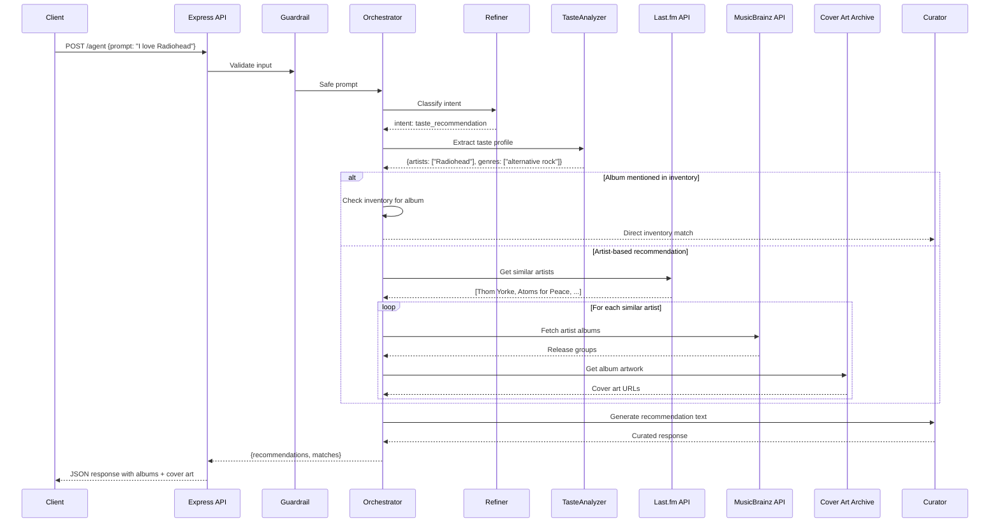
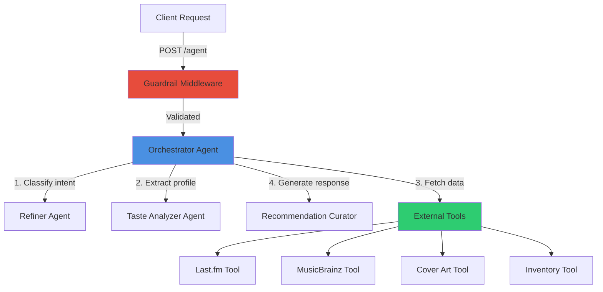

# Needle Drop Records - AI Music Recommendation System

An AI-powered music recommendation API that helps vinyl enthusiasts discover their next favorite album. Built with Express, TypeScript, and OpenAI's Agents SDK, this system orchestrates multiple specialized agents to provide personalized, context-aware music recommendations.

## Fictitious Company Scenario

**Needle Drop Records** is a boutique vinyl record store specializing in curated collections across multiple genres. Our AI recommendation system acts as a virtual music connoisseur, analyzing customer taste profiles and suggesting albums from both our inventory and the broader music landscape through Last.fm data.

## Project Overview

This project demonstrates an enterprise-grade agentic AI architecture featuring:
- **Multi-agent orchestration** with specialized sub-agents
- **External API integration** (Last.fm, MusicBrainz, Cover Art Archive)
- **Runtime type safety** with Zod validation
- **Local-first development** using Ollama (llama3.2)
- **Production-ready** OpenAI integration
- **Input guardrails** for safe, moderated interactions

## Architecture

### System Flow



### Agent Hierarchy



## Agent Responsibilities

| Agent | Purpose | Key Features |
|-------|---------|--------------|
| **Orchestrator** | Main workflow coordinator | Routes requests, manages conversation state, fallback logic |
| **Refiner** | Intent classification | Identifies user intent (taste_recommendation, pricing, off_topic, etc.) |
| **Taste Analyzer** | Musical preference extraction | Parses artist mentions, genres, albums, and era preferences |
| **Recommendation Curator** | Natural language generation | Crafts engaging, context-aware recommendation text |

## External Tools

| Tool | API | Purpose |
|------|-----|---------|
| **Last.fm Integration** | [Last.fm API](https://www.last.fm/api) | Retrieves similar artists based on user listening data |
| **MusicBrainz Lookup** | [MusicBrainz API](https://musicbrainz.org/doc/MusicBrainz_API) | Fetches album metadata, release dates, artist info |
| **Cover Art Archive** | [Cover Art Archive](https://coverartarchive.org/) | Downloads high-quality album artwork |
| **Inventory Tool** | Internal | Filters in-stock vinyl records by genre |

## Getting Started

### Prerequisites

- Node.js 20+
- npm or yarn
- [Ollama](https://ollama.ai/) (for local development)
- Last.fm API key

### Installation

```bash
# Clone the repository
git clone https://github.com/JoshSald/agenticai
cd agenticai

# Install dependencies
npm install

# Set up environment variables
cp .env.example .env
# Edit .env with your API keys
```

### Environment Variables

Create a `.env` file in the root directory:

```env
# LLM Configuration
NODE_ENV=development
OPENAI_API_KEY=your_openai_key_here

# Local Development (Ollama)
OLLAMA_BASE_URL=http://localhost:11434
OLLAMA_MODEL=llama3.2

# External APIs
LASTFM_API_KEY=your_lastfm_key_here

# Server
PORT=3000
```

### Running the Application

```bash
# Development (uses Ollama)
npm run dev

# Production (uses OpenAI)
NODE_ENV=production npm start
```

The API will be available at `http://localhost:3000`

## API Documentation

### POST /agent

Main endpoint for music recommendations.

**Request:**
```json
{
  "prompt": "I love Radiohead and atmospheric rock"
}
```

**Response:**
```json
{
  "recommendations": "If you're into Radiohead's atmospheric sound, you'll love Thom Yorke's solo work on Tomorrow's Modern Boxes. The album features similarly introspective production with electronic textures that recall OK Computer's more experimental moments...",
  "matches": [
    {
      "artist": "Thom Yorke",
      "album": "Tomorrow's Modern Boxes",
      "genre": ["alternative rock", "electronic"],
      "era": "2014",
      "available": false,
      "musicBrainzId": "...",
      "coverArt": "https://coverartarchive.org/..."
    }
  ],
  "state": {
    "likedArtists": ["Radiohead"],
    "confirmedGenres": ["alternative rock"],
    "excludedGenres": [],
    "recommendedAlbums": []
  }
}
```

### Error Responses

**400 Bad Request** - Invalid input
```json
{
  "error": "Validation error",
  "details": ["prompt is required"]
}
```

**500 Internal Server Error** - Server error
```json
{
  "error": "Internal server error"
}
```

## Guardrails

The system implements multiple layers of safety:

1. **Input Validation** - Zod schemas ensure type safety
2. **Guardrail Middleware** - Filters inappropriate content before processing
3. **Intent Classification** - Refiner agent identifies and handles off-topic requests
4. **Conversation State** - Tracks user preferences to avoid repetition

## Project Structure

```
agenticai/
├── src/
│   ├── agents/              # AI agent implementations
│   │   ├── orchestrator.agent.ts
│   │   ├── refiner.agent.ts
│   │   ├── tasteAnalyzer.agent.ts
│   │   └── recommendationCurator.agent.ts
│   ├── tools/               # External API integrations
│   │   ├── lastfm.tool.ts
│   │   ├── musicbrainz.tool.ts
│   │   ├── coverart.tool.ts
│   │   ├── inventory.tool.ts
│   │   └── recommendation-enricher.tool.ts
│   ├── middlewares/         # Express middlewares
│   │   ├── guardrail.ts
│   │   ├── validate.ts
│   │   └── errorHandler.ts
│   ├── schemas/             # Zod validation schemas
│   │   ├── agent.schema.ts
│   │   ├── taste.schema.ts
│   │   └── refinedIntent.schema.ts
│   ├── conversation/        # State management
│   │   ├── conversationState.ts
│   │   └── hasEnoughTastesSignal.ts
│   ├── helpers/             # Utility functions
│   │   ├── inferGenre.ts
│   │   └── normalizeResponse.ts
│   ├── data/                # Static data
│   │   └── inventory.ts
│   ├── llm/                 # LLM client configuration
│   │   └── client.ts
│   ├── routes/              # Express routes
│   │   └── agent.route.ts
│   ├── app.ts               # Express app setup
│   └── server.ts            # Server entry point
├── frontend/                # React + Vite frontend
├── logs/                    # Server logs
├── README.md
└── package.json
```

## Technology Stack

- **Runtime**: Node.js 20
- **Framework**: Express.js
- **Language**: TypeScript
- **Validation**: Zod
- **LLM (Dev)**: Ollama (llama3.2)
- **LLM (Prod)**: OpenAI GPT-4o-mini
- **External APIs**: Last.fm, MusicBrainz, Cover Art Archive
- **Frontend**: React, Vite, TailwindCSS

## Key Features

**Multi-Agent Orchestration** - Specialized agents for different tasks  
**Type-Safe Validation** - Zod schemas for runtime safety  
**Local Development** - Ollama for cost-free local testing  
**External API Integration** - Real music data from Last.fm & MusicBrainz  
**Conversation State** - Context-aware recommendations  
**Album Art Enrichment** - Visual presentation with cover artwork  
**Guardrails** - Safe, moderated user interactions  
**Error Handling** - Graceful fallbacks and error responses  

## Learning Outcomes

This project demonstrates:
- Building production-grade Express APIs with TypeScript
- Implementing agentic AI workflows with OpenAI SDK
- Runtime type validation with Zod
- External API integration and error handling
- State management in conversational systems
- Local-first development with Ollama
- Middleware patterns for guardrails and validation
- UML diagramming for complex systems

## Contributing

This is a solo project for educational purposes. For questions or feedback, please open an issue.

## License

MIT

---

**Note**: This project uses fictitious company data (Needle Drop Records) for demonstration purposes. The inventory and recommendations are designed to showcase the AI agent architecture.